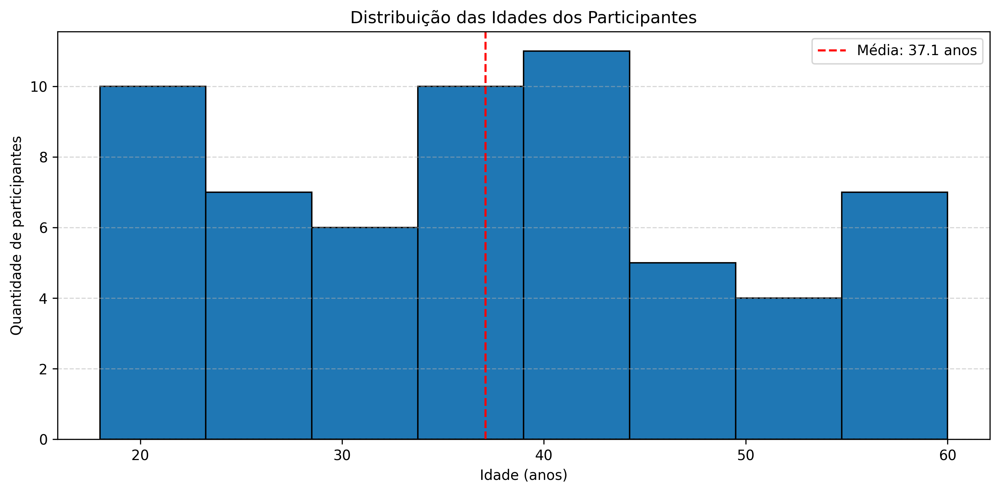
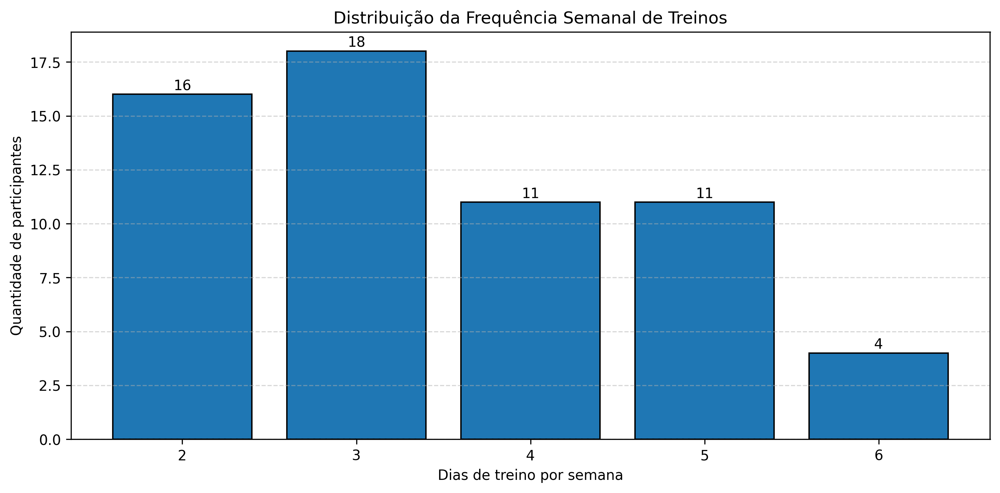
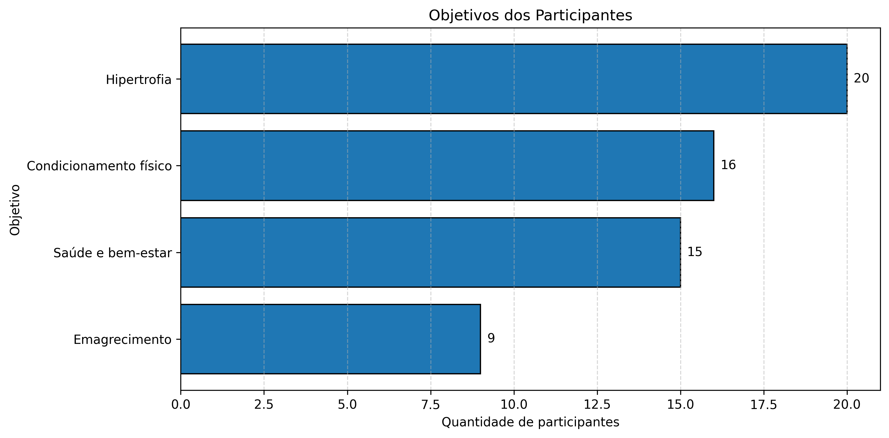
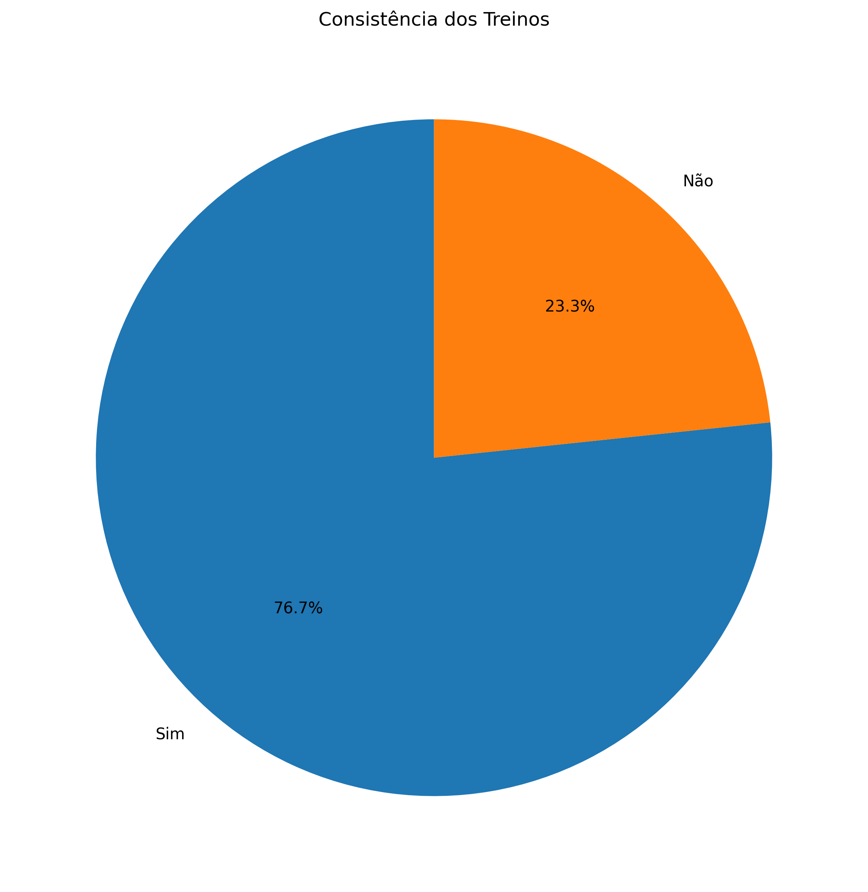

# Análise de Hábitos de Treino e Saúde (ODS 3)

Projeto desenvolvido para a disciplina de Ciência de Dados com foco na aplicação de técnicas de análise de dados utilizando Python.

## Objetivo

Analisar hábitos de treino de praticantes de atividade física e relacionar os resultados ao Objetivo de Desenvolvimento Sustentável 3 (ODS 3) da ONU - Saúde e Bem-Estar.

## Tecnologias Utilizadas

- Python
- Pandas
- Matplotlib

## Dados Analisados

A pesquisa considerou:

- Idade
- Gênero
- Frequência semanal de treino
- Objetivo do treino
- Tempo de experiência
- Consistência dos treinos

## Principais Análises

- Estatística descritiva
- Distribuição etária
- Frequência semanal de treinos
- Objetivos dos participantes
- Consistência da prática de exercícios

## Principais Resultados

- 60 participantes analisados
- Idade média de 37 anos
- Frequência de treino mais comum: 3 dias por semana
- Maioria dos participantes relatou manter consistência nos treinos

## Relatório

O relatório completo do projeto pode ser consultado em:

[Relatório Final](relatorio/relatorio_final.pdf)

## Gráficos Gerados

### Distribuição das Idades



### Frequência Semanal de Treinos



### Objetivos dos Participantes



### Consistência dos Treinos



## Como Executar

Instale as dependências:

```bash
pip install -r requirements.txt
```

Execute:

```bash
python habitos_de_treino.py
```

## Observação

Os dados utilizados neste projeto foram simulados para fins acadêmicos.